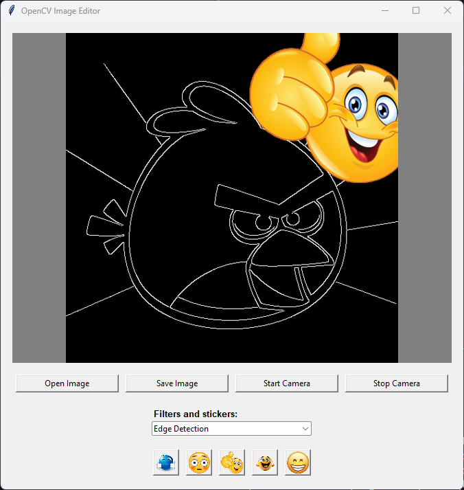

# Filtros - OpenCV

Este projeto consiste em um pequeno editor de imagens que possibilita aplicar filtros e stickers (sobreposição). 

O programa permite utilizar tanto imagens locais quanto o feed da câmera (se houver) como fonte de dados. 

A aplicação foi construída com Python, OpenCV e Tkinter.

# Executar o projeto

Primeiramente, é necessário instalar as dependências: `pip install -r requirements.txt`.

Para executar: `python main.py`.

# Créditos e vídeo apresentação

Bruno Hoffmeister Groehs, Rafael Scholz Griebler e Théo Rossetto

https://youtu.be/_pRezPq0Qf4

